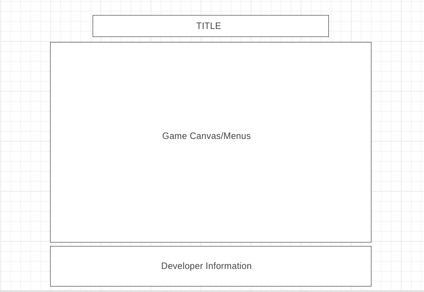

# The Floor is Lava

<a href="https://github.com/rweir4/TheFloorIsLava">Live Version</a>

## Background
There is a player (which has the ability to jump) and a board (which has "random" width and height platforms). If the player falls off the platforms, they die.
 - controls: arrow keys to move, space to jump, m to menu

## MVP
1.) Board

2.) Player

3.) Start, pause, and reset of the game

4.) Menu with rules of the game

5.) Production ReadME

## Technologies, Libraries, APIs
The game runs using javascript for logic, vanilla for functionality, and canvas, HTML, and CSS for rendering and sprites.

## Wireframes

## Implementation Timeline:

Day 1) Board
  - sprite for platform
  - random size and placement of platforms
  - scrolling background

Day 2) Player
 - sprite for character
 - jumping
   - parabola based on arrow keys
   - double jump

Day 3) Start, pause, reset of game, production readme
 - modal

 ## Future Features

 - Add gravity to fall
 - Add real image for player that will change upon walk
 - Add second level with more sparse platforms and double jump
